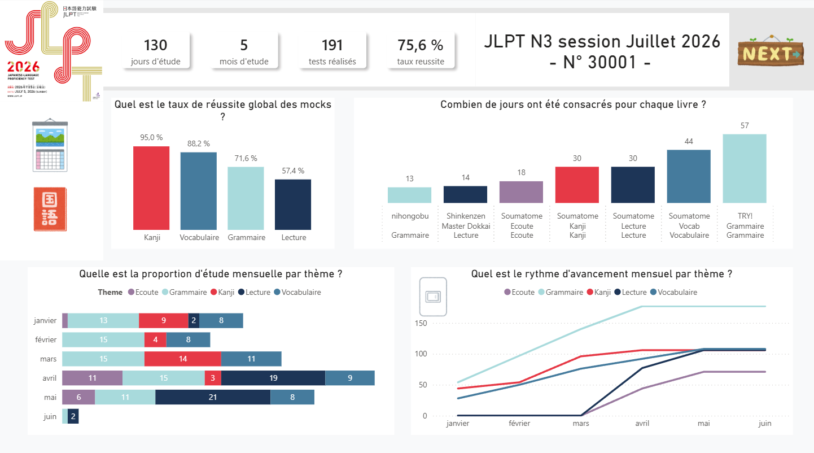
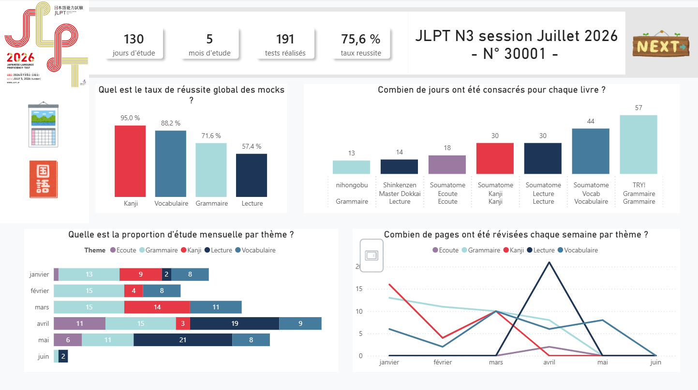
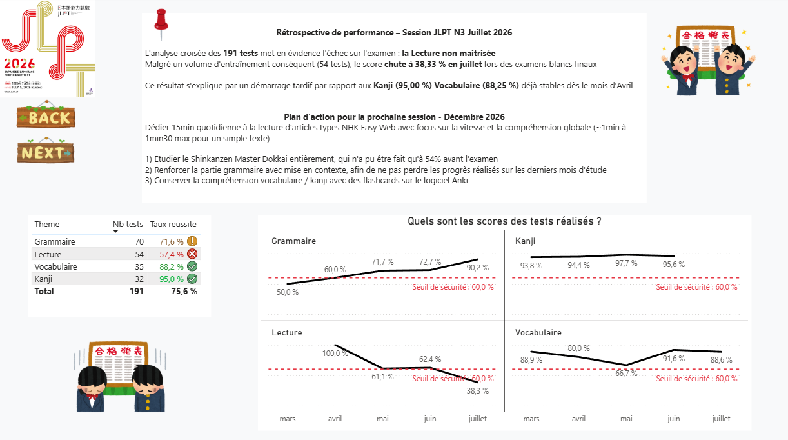
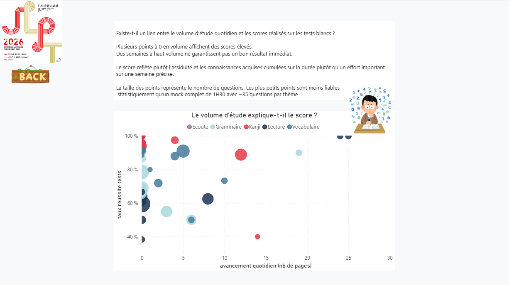
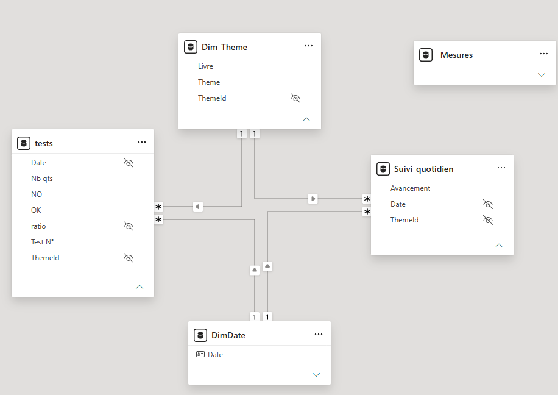
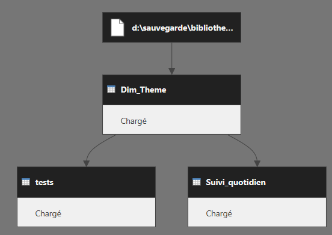

# 日本語能力試験 - JLPT N3 Study Dashboard
 

> Dashboard Power BI analysant 6 mois de préparation au JLPT N3 (janvier - juillet 2026)
> Données issues d'un suivi quotidien Excel
 
---
 
## Introduction

A l'origine, j'ai créé le fichier Excel source pour suivre ma progression quotidienne étant donné que les ressources pour le niveau N3 était divisé en plusieurs livres.
Cela me permettait de voir où j'en étais, si la progression était constante, afin d'adapter mon apprentissage pour être prêt en seulement 6 mois.

Après l'examen, j'avais assez de données en ma possession pour analyser mes forces et faiblesses et le transformer en un projet.
Il permettrait ainsi de visualiser la progression à travers les mois et définir sur un plan d'action correctif des 6 prochains mois.
 
Enjeux du Dashboard :
1. **Reconstruire proprement** le suivi en modèle relationnel (schéma en étoile, mesures DAX) plutôt que des formules Excel figées.
2. **Répondre à une vraie question analytique** : est-ce que le volume d'étude d'une semaine donnée explique le score obtenu à cette période, ou est-ce que d'autres facteurs pèsent davantage ?
---
 
## Pages
 
| Page | Description |
|---|---|
| **Accueil** | KPI globaux (jours d'étude, nb tests, taux de réussite), répartition de l'effort par livre et par thème, rythme d'avancement cumulé |
| **bilan** | Analyse des tests blancs, taux de réussite par thème vs seuil de sécurité, plan d'action pour la session suivante |
| **correlation** | Le volume d'étude explique-t-il le score aux tests et à l'examen ? |
 
---
 
## Stack technique
 
| Composant | Détail |
|---|---|
| **Source** | Fichier Excel de suivi (saisie manuelle quotidienne, résultats aux exercices, scores de mocks, avancement du nombre de pages par livre) |
| **Transformation** | Power Query M — nettoyage et uniformisation des colonnes | Pivot | Fusion tables | Dimension |
| **Modélisation** | Schéma en étoile — `DimDate` et `Dim_Theme`, 2 tables de faits (`tests`, `Suivi_quotidien`) |
| **Calculs** | DAX — `CALCULATE`, `ALL`, `DATEADD`, `DIVIDE`, `DISTINCTCOUNT`, `FILTER` |
| **Outil** | Power BI Desktop |
| **Fonctionnalités** | Menu, boutons et changement de graphique avec les fonctions de Sélection + Signets | 
 
 ---
 
## Aperçu
 
### Vue d'ensemble

### Bilan

### Correlation résultats mocks / avancement 

---

## Modèle de données

### Schéma en étoile

### Dépendances Power Query

---
 
## Sources
 
| Source | Usage |
|---|---|
| Suivi Excel | saisie quotidien d'étude, résultats des exercices, scores des mocks |
| Illustrations | JLPT visuel officiel |
| [irasutoya.com](https://www.irasutoya.com) | Illustrations libres de droits |
